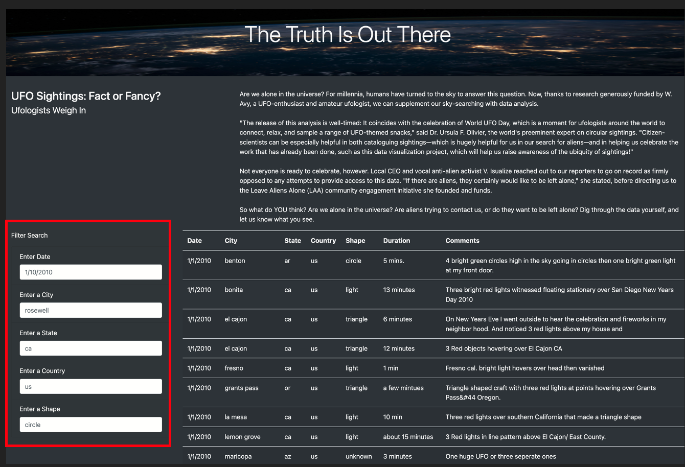

# UFOs

## Overview/Purpose of Project: 
   * The overall purpose of this project was to improve Dana’s UFOs webpage by creating a dynamic table that will enable users to conduct a more in-depth analysis of UFO sightings. Moreover, users would be able to refine their searches and filter for multiple criteria at the same time such as date, city, state, country, and shape. Javascript and HTML were leveraged to accomplish this task and the overall result satisfied Dana's intent. See below for details/results. 

## Results: 
   * Using JavaScript and HTML, we modified the code in the index.html and app.js files to create and visualize additional table filters on the webpage. As depicted in the image below (outlined by the red square), we created filters for the date, city, state, country, and shape to give the user the ability to create even more refined searches within the UFOs data.
   *  
   * Describe to Dana how someone might use the new webpage by walking her through the process of using the search criteria. Use images of your webpage during the filtering process to support your explanation.

## Summary: In a summary statement, describe one drawback of this new design and two recommendations for further development.
