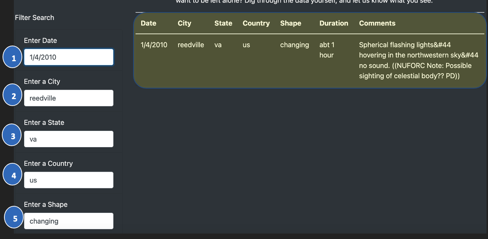

# UFOs

## Overview/Purpose of Project: 
   * The overall purpose of this project was to improve Dana’s UFOs webpage by creating a dynamic table that will enable users to conduct a more in-depth analysis of UFO sightings. Moreover, users would be able to refine their searches and filter for multiple criteria at the same time such as date, city, state, country, and shape. Javascript and HTML were leveraged to accomplish this task and the overall result satisfied Dana's intent. See below for details/results. 

## Results: 
   * Using JavaScript and HTML, we modified the code in the index.html and app.js files to create and visualize additional table filters on the webpage. As depicted in the image below (outlined by the red square), we created filters for the date, city, state, country, and shape to give the user the ability to create even more refined searches within the UFOs data.
   *  
   * Below is an example of how the filtering process works. Of note, the numbered circles are strictly for reference purposes and do not show up on the webpage. In the image below, we filtered our search to show only UFO sightings that occurred on 1/4/2010 in Reedville, Virginia with the shape of "changing." In this case, searching for the shape of "changing" was unnecessary since there was only one event in reedville, virginia on this day but was done for demonstration purposes. 
   *  

## Summary: 
   * Like any new design, there can exist drawbacks that need to be improved. One big drawback is the case sensitive nature of the search. For instance, drawback of this new design and two recommendations for further development.
