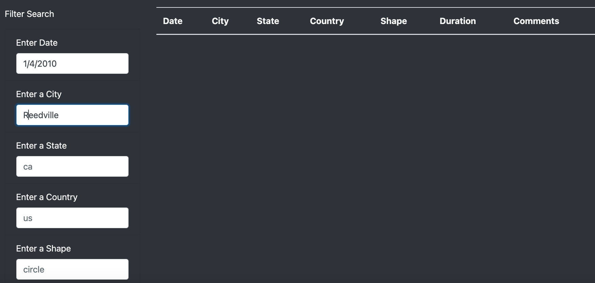

# UFOs

## Overview/Purpose of Project: 
   * The overall purpose of this project was to improve Dana’s UFOs webpage by creating a dynamic table that will enable users to conduct a more in-depth analysis of UFO sightings. Moreover, users would be able to refine their searches and filter for multiple criteria at the same time such as date, city, state, country, and shape. Javascript and HTML were leveraged to accomplish this task and the overall result satisfied Dana's intent. See below for details/results. 

## Results: 
   * Using JavaScript and HTML, we modified the code in the index.html and app.js files to create and visualize additional table filters on the webpage. As depicted in the image below (outlined by the red square), we created filters for the date, city, state, country, and shape to give the user the ability to create even more refined searches within the UFOs data.
   *  
   * Below is an example of how the filtering process works. Of note, the numbered circles are strictly for reference purposes and do not show up on the webpage. In the image below, we filtered our search to show only UFO sightings that occurred on 1/4/2010 in Reedville, Virginia with the shape of "changing." In this case, searching for the shape of "changing" was unnecessary since there was only one event in reedville, virginia on this day but was done for demonstration purposes. 
   *  

## Summary: 
   * Like any new design, there can exist drawbacks that need to be improved. One big drawback is the case sensitive nature of the search and a lack of instruction for the user regarding parameters. For instance, if we conducted the same search as previously demonstrated but instead capitalized the "r" in reedville we would retrieve 0 results. See below. 
     * 
   * Below are three recommendations for further development.
     * 1) In the HTML file, write a disclaimer for the user indicating searches are case sensitive and to make the sure the beginning letter of the word is lowercased. This will mitigate the number of failed filtered searches. 
     * 2) In the HTML file, provide examples of "shapes". Unless the user is fully familiar with the data source, the "shape" filter can easily cause searches to fail if the user is not provided with examples of which shapes are out there such as "light", "triangle", "flash", etc. Perhaps a simple drop down menu can help. 
     * 3) Create a "clear all filters" button to make it easier for the user to reset and conduct additional searches. This will save the user's time deleting words from the search boxes. 
 
